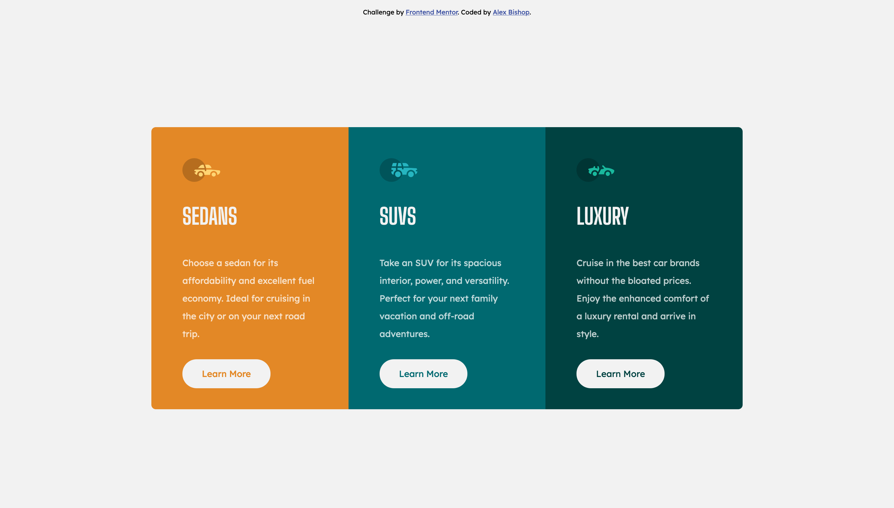

# Frontend Mentor - 3-column preview card component solution

This is a solution to the [3-column preview card component challenge on Frontend Mentor](https://www.frontendmentor.io/challenges/3column-preview-card-component-pH92eAR2-). Frontend Mentor challenges help you improve your coding skills by building realistic projects. 

## Table of contents

- [Overview](#overview)
  - [The challenge](#the-challenge)
  - [Screenshot](#screenshot)
  - [Links](#links)
- [My process](#my-process)
  - [Built with](#built-with)
  - [What I learned](#what-i-learned)
- [Author](#author)

## Overview

### The challenge

Users should be able to:

- View the optimal layout depending on their device's screen size
- See hover states for interactive elements

### Screenshot

### Links

- Solution URL: [Add solution URL here](https://your-solution-url.com)
- Live Site URL: [Add live site URL here](https://your-live-site-url.com)

## My process

This was my first attempt at trying Mobile-first development, and honestly I really enjoyed how it went!
I'm not great at media queries yet, but I feel like what I ended up with works pretty well.

I began with the basic HTML structure and tags. 
Then, I continued with the styling of the basic card layout.
Then I styled the cards as a whole to work together.
Finally, I styled the desktop version.

### Built with

- Semantic HTML5 markup
- CSS custom properties
- CSS Grid
- Mobile-first workflow

### What I learned

This was my first time using grid and mobile first. It was only my second time using media queries. All three of these areas were places I knew I needed to better practice, and this allowed me to do so!

## Author

- Frontend Mentor - [@alexdeanb](https://www.frontendmentor.io/profile/alexdeanb)
- Twitter - [@adeanbishop](https://www.twitter.com/adeanbishop)
